# Corporate GHG Emissions Panel

Descriptive panel analysis of Scope 1 and Scope 2 greenhouse gas emissions for publicly listed U.S. companies, 2010–2024. The pipeline matches LSEG/Refinitiv ESG disclosures to EPA GHGRP facility-level data and EPA eGRID state electricity emissions factors to produce a firm-year panel with 80,633 observations across 5,040 unique firms.

No regressions. The analysis is intentionally descriptive, designed to characterize cross-sectional and time-series variation in corporate emissions before any causal modeling.

---

## Data Sources

| Source | What it provides |
|---|---|
| LSEG/Refinitiv Workspace | ESG company identifiers, reported Scope 1 & 2, energy use (MWh), 2010–2024 |
| EPA GHGRP | Facility-level direct emissions (CO₂e) and state location, 2010–2023 |
| EPA eGRID | State-level electricity emissions factors (lb CO₂e / MWh), 2010–2022 |
| Compustat / WRDS | GVKey identifiers and 4-digit SIC codes for Fama-French classification |

---

## Pipeline

```
1_extraction/   LSEG screen → fuzzy match to Compustat → ESG history pull
      ↓
   data/scope2_esg_data_20260313.csv

2_scope1/       EPA GHGRP facility data → ownership-adjusted firm totals
      ↓
   data/master_emissions.csv
   data/master_emissions_detail.csv

3_scope2_egrid/ eGRID state factors × LSEG energy use → location-based Scope 2
      ↓
   data/scope2_final.csv

emissions_analysis.ipynb   (root)
      ↓
   figures/
```

Scope 2 is sourced in priority order: (1) reported location-based from LSEG, (2) eGRID-calculated from energy use × state factor. About 90% of firm-years have no Scope 2 data.

---

## Key Constructs

**Grid factor** — state-level electricity emissions intensity (`egrid_ef_lb_per_mwh`), a property of where the firm operates, not how it operates. Firms are split into High Grid / Low Grid at the sample median (822 lb CO₂e / MWh).

**Firm factor** — Scope 1 emissions (lb CO₂e) divided by energy use (MWh), measuring how carbon-intensive the firm's own operations are, independent of the local electricity mix. Split at the sample median into High / Low.

**Firm size** — proxied by `log(facility_count + 1)`, split into Small / Medium / Large by the 25th and 75th percentiles. `data/financial_data.csv` (Total Assets, Market Cap from LSEG) is available but not yet wired into the notebook's size variable.

All continuous variables are winsorized at the 1st and 99th percentile. Scope 2 winsorization bounds are computed on the `reported_location` subsample only, to prevent implausibly large eGRID-calculated values from inflating the shared tail.

---

## Figures

### Figure 1 — Annual Emissions Trends (All Firms)
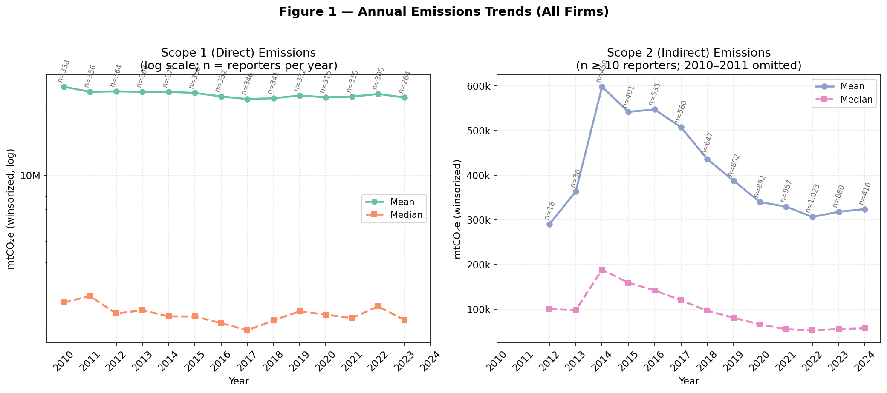

Two panels showing overall Scope 1 (left, log scale) and Scope 2 (right, linear) trends from 2010 to 2024.

**Scope 1** ranges from 264 to 370 EPA reporters per year. The log scale reveals that the mean (~24M mtCO₂e) is driven by a handful of very large industrial emitters, while the median is orders of magnitude lower — a persistent feature of the heavy-tail distribution of direct emissions. The series is broadly flat across the sample period, with a trough around 2016–2017 and a transient spike in 2022.

**Scope 2** is limited to `reported_location` observations with at least 10 reporters per year; 2010–2011 are omitted. Coverage ramps up meaningfully starting around 2012–2014, peaking at roughly 1,000 reporters with a mean of ~600k mtCO₂e, then declining steadily to ~300k mtCO₂e by 2023–2024. The declining mean likely reflects a combination of grid decarbonization, corporate renewable energy procurement, and compositional change in who reports.

---

### Figure 2 — Scope 1 vs. Scope 2 Mean Emissions (Dual Axes)
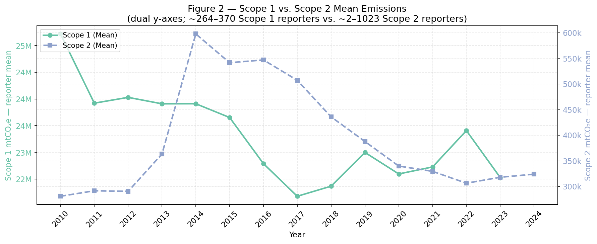

Plots both scope means on the same time axis with separate y-axes to enable visual comparison of magnitude and trajectory.

Scope 1 (green, left axis) is in the 22–25M mtCO₂e range — roughly 60–80× larger than the Scope 2 mean on the right axis — reflecting the fact that Scope 1 reporters are concentrated in energy-intensive industries (utilities, energy, chemicals) mandated to report to EPA, while Scope 2 reporters are a more diverse but generally smaller set of voluntary ESG disclosers. The Scope 2 series peaked sharply around 2014 (~590k mtCO₂e) and has trended down since; the Scope 1 series has no clear trend.

---

### Figure 3 — Emissions by Firm Size (Time Trends)
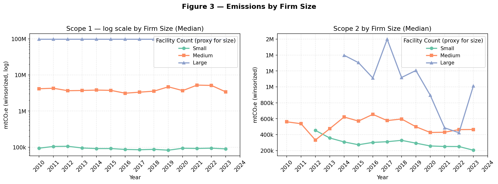

Median emissions over time for Small, Medium, and Large firms, where size is proxied by log(facility count). The log scale on the Scope 1 panel is necessary to show all three groups simultaneously.

The size gradient in Scope 1 is monotonic and extremely stable: Large firms (~100M mtCO₂e median) emit roughly 20× more than Medium (~3–5M) and 1,000× more than Small (~100k). This is not surprising given that "Large" here means firms with many EPA-regulated facilities. The Scope 2 panel shows a similar size ordering (~1M, ~500k, ~280k) but with more year-to-year volatility, consistent with the smaller Scope 2 reporter sample.

---

### Figure 3b — Emission Distributions by Size (2023 Snapshot)
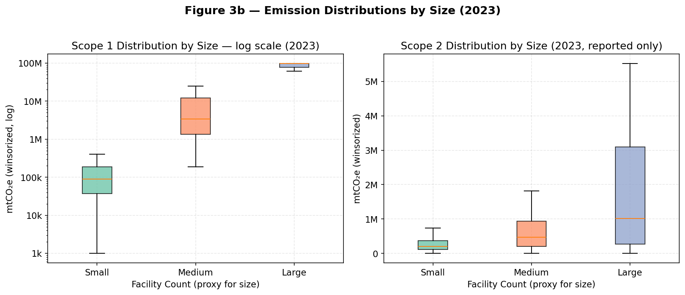

Cross-sectional boxplots for the most recent well-populated year (2023).

The Scope 1 box for Large firms is compressed near the winsorization ceiling (~97M mtCO₂e), indicating that essentially all large-facility firms are at or near the reporting maximum — the distribution is right-censored by design. Medium firms show a wide IQR spanning 1M–10M, while Small firms cluster tightly around 100k with modest spread. The Scope 2 panel shows the opposite: Large firms have the widest distribution (IQR roughly 0–3M), reflecting heterogeneity in energy intensity within the large-firm category.

---

### Figure 4 — Emissions by Grid Factor Subgroup
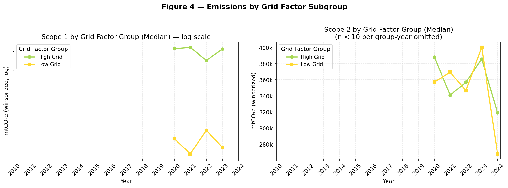

High Grid vs. Low Grid firm-year observations over time, where grid assignment follows the eGRID state factor for the firm's primary facility state.

The subgroup only has sufficient coverage from 2019–2023 for Scope 1 and from 2017–2024 for Scope 2, reflecting sparse eGRID state matches in earlier years. High Grid firms (dirty electricity states) have consistently higher Scope 1 emissions — ~23.5M mtCO₂e mean vs. ~14.4M for Low Grid — consistent with heavy industry clustering in coal-intensive states. Scope 2 High Grid and Low Grid medians are close (both around 350–400k mtCO₂e), suggesting that conditional on reporting Scope 2, the grid factor does not sharply differentiate emissions levels, though the trend lines cross in some years.

---

### Figure 4b — Grid Factor by State (Top 30 States)
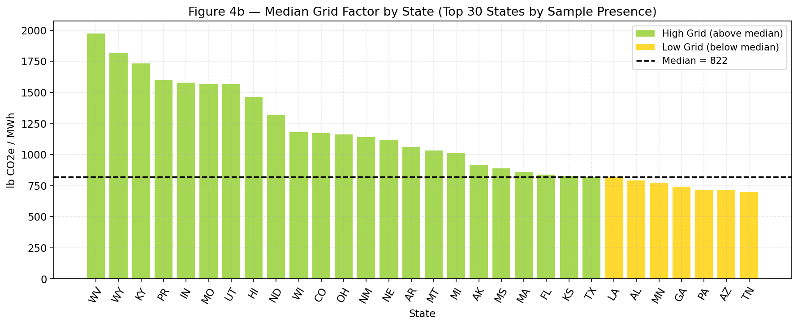

Bar chart of median eGRID emission intensity for the 30 states most represented in the sample, colored by High / Low Grid classification (sample median = 822 lb CO₂e / MWh).

West Virginia (~1,975), Wyoming (~1,820), and Kentucky (~1,740) are the dirtiest grids, driven by coal-heavy generation. Hawaii (PR is Puerto Rico) appears high despite its geography, reflecting legacy diesel generation. States crossing below the median include Louisiana, Alabama, Minnesota, Georgia, Pennsylvania, Arizona, and Tennessee — a mix of natural gas (LA), nuclear (MN, PA), and hydro/wind (AZ, TN) states. The distribution is right-skewed: a small number of coal-heavy states are well above the median, while most states cluster in the 700–900 lb range.

---

### Figure 5 — Emissions by Firm Factor Subgroup
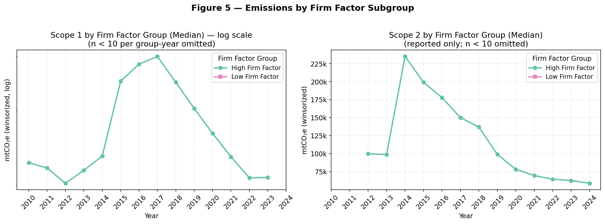

High Firm Factor vs. Low Firm Factor groups, where firm factor = Scope 1 (lb CO₂e) / Energy Use (MWh). Only High Firm Factor firms appear in both panels — Low Firm Factor firms fall below the MIN_N = 10 threshold in most years, because high energy use without high direct emissions is rare among EPA GHGRP reporters.

High Firm Factor Scope 1 shows a pronounced peak around 2015–2017 before declining sharply — likely driven by energy sector activity (oil & gas, coal) during and after the commodity cycle. The corresponding Scope 2 series peaks in 2014 (~235k mtCO₂e) and declines steadily to ~60k by 2024, consistent with the overall Scope 2 trend.

---

### Figure 5b — 2×2 Grid × Firm Factor Decomposition
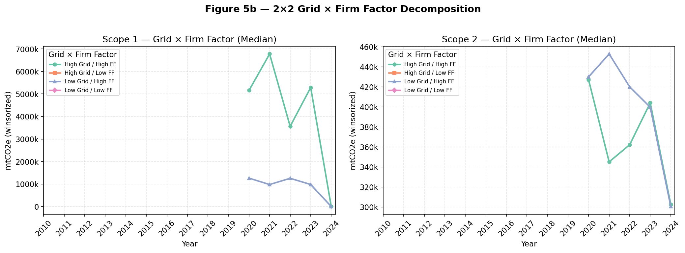

Cross-tabulation of High/Low Grid with High/Low Firm Factor. Only the High Grid / High FF cell has enough observations to plot reliably — the other three quadrants fall below MIN_N in most years. This means firms that both operate in dirty-grid states AND have carbon-intensive operations are the only group with consistent Scope 1 and Scope 2 data in the grid-matched subsample. The Scope 1 peak for High Grid / High FF around 2021 (~6.5M mtCO₂e) and subsequent collapse to near zero in 2024 suggests data sparsity at the tail of the sample rather than an operational change.

---

### Figure 6 — Scope 1 by FF12 Industry (Full Sample)
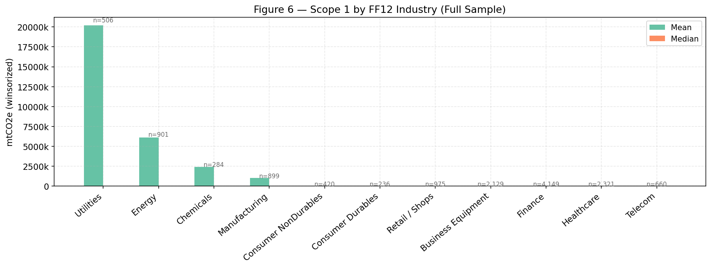

Mean and median Scope 1 by Fama-French 12 industry, sorted by mean. FF12 classification applied using 4-digit SIC codes from WRDS Compustat.

Utilities dominate by an order of magnitude (~20M mtCO₂e mean, n=506 firm-years), followed by Energy (~6.3M, n=901) and Chemicals (~2.5M, n=284). Manufacturing is fourth (~1M, n=899). All other industries — Finance, Healthcare, Business Equipment, Retail, Telecom, Consumer sectors — are visually indistinguishable from zero at this scale. The near-zero medians across all industries (including Utilities) confirm the heavy right-skew: most firms, even in the most emissions-intensive sectors, emit far less than the sector mean.

---

### Figure 6 — Scope 2 by FF12 Industry (Full Sample)
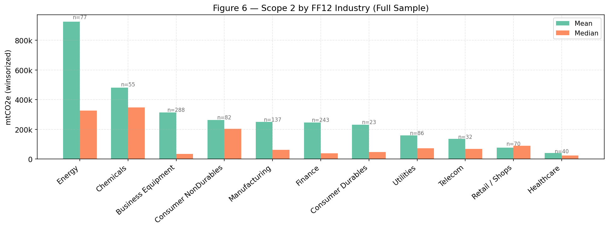

Same cross-sectional comparison for Scope 2. The industry ranking differs substantially from Scope 1.

Energy leads Scope 2 as well (~930k mtCO₂e mean, n=77), but Utilities — the top Scope 1 emitter — falls to eighth (~155k, n=86). This inversion makes sense: utilities generate electricity, so their emissions are Scope 1 (direct) from their own plants; other industries *purchase* that electricity, recording it as Scope 2. Business Equipment (tech/IT) ranks third (~315k, n=288) — surprisingly high for a sector with near-zero Scope 1, reflecting large energy consumption in data centers and office campuses. The mean-median gaps are largest for Energy (ratio ~2.8×) and smallest for Healthcare (~2×), indicating more homogeneous Scope 2 footprints in healthcare.

---

### Figure 6b — Emissions Trends by FF12 Industry (Top 6)
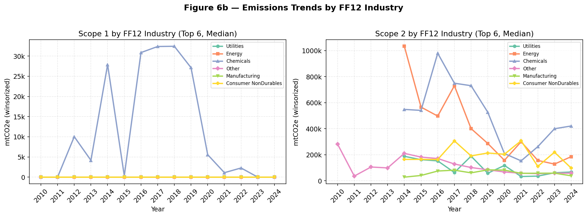

Time-series of median emissions for the six highest Scope 1 industries. Utilities dominate the Scope 1 panel throughout (median around 25–30k, in thousands of mtCO₂e), with Energy a distant second. In the Scope 2 panel, Utilities and Energy trade positions over time, with other industries (Chemicals, Manufacturing, Consumer NonDurables) converging toward similar levels post-2018.

---

### Figure 7 — Scope 2 Coverage by Source Type
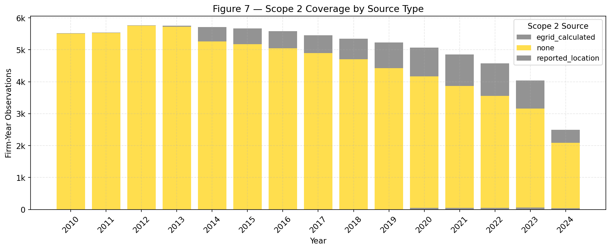

Stacked bar chart showing the composition of the panel by Scope 2 source each year.

The dominant takeaway is scale: roughly 90% of firm-year observations have no Scope 2 data ("none," yellow) in every year. The gray reported-location bars are largest from 2014–2018, peaking at around 600–800 firm-years (~12–15% of the annual panel), then tapering toward 2023–2024. The eGRID-calculated slice is a thin sliver throughout — fewer than 50 firm-years per year — reflecting how rarely a firm has energy use data but no self-reported Scope 2. The total panel size declines after 2022, driven by fewer LSEG ESG observations in the most recent years.

---

### Figure 8 — Emissions by Grid Factor × Firm Size
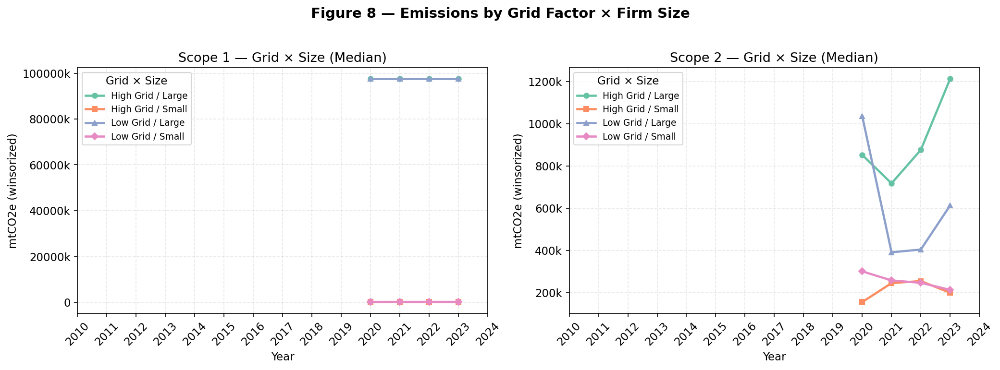

Interaction of grid factor (High/Low) and firm size (Large/Small) to test whether the grid-factor effect on emissions is concentrated in particular size tiers.

The Scope 1 panel shows that both "High Grid / Large" and "Low Grid / Large" firms are at the winsorization ceiling (~97–100M mtCO₂e), while Small firms in both grid groups are near zero — size entirely dominates grid assignment for Scope 1, and data only appears from 2020 onward. The Scope 2 panel is more informative: High Grid / Large firms have the highest Scope 2 (~850k–1.2M mtCO₂e), followed by Low Grid / Large (~400–600k), then High Grid / Small (~150–300k). This suggests an interaction — being in a dirty-grid state has a larger effect on Scope 2 for larger firms than for smaller ones, which is consistent with large firms consuming more electricity in absolute terms.

---

## Summary Statistics

| Variable | N | Mean | Median | P10 | P90 |
|---|---|---|---|---|---|
| Scope 1 (mtCO₂e, winsorized) | 80,633 | 1,366,129 | 0 | 0 | 0 |
| Scope 2 (mtCO₂e, winsorized) | 7,738 | 397,915 | 78,123 | 2,983 | 1,048,271 |
| Energy Use (MWh, winsorized) | 12,685 | 24,760,371 | 1,904,400 | 62,185 | 52,734,800 |
| Grid Factor (lb CO₂e/MWh) | 1,426 | 885 | 822 | 458 | 1,577 |
| Firm Factor (lb CO₂e/MWh equiv.) | 12,685 | 67,712 | 0 | 0 | 112 |

The zero medians for Scope 1 and Firm Factor reflect that most firm-years in the panel are LSEG-covered companies with no EPA GHGRP Scope 1 disclosure — the panel includes both reporters and non-reporters.

**By Grid Factor Group (Scope 1 reporters only):**

| Group | N | Scope 1 Mean | Scope 1 Median |
|---|---|---|---|
| High Grid | 729 | 23,500,720 | 1,268,231 |
| Low Grid | 697 | 14,380,762 | 619,803 |

**By Firm Size Group (facility-count proxy):**

| Size | N | Scope 1 Mean | Scope 2 Mean |
|---|---|---|---|
| Large | 1,101 | 75,245,733 | 1,784,331 |
| Medium | 2,031 | 13,097,207 | 801,139 |
| Small | 1,606 | 441,508 | 512,062 |

---

## Repo Structure

```
corp-emissions/
├── 1_extraction/               LSEG extraction and Compustat matching
├── 2_scope1/                   EPA GHGRP → firm-level Scope 1
├── 3_scope2_egrid/             eGRID state factors → location-based Scope 2
├── figures/                    Output figures (PNG)
├── data/                       Production CSVs
├── emissions_analysis.ipynb    Analysis notebook (run from project root)
├── README.md
└── directory.txt               Full file-level documentation
```

See `directory.txt` for a complete description of every file, including sizes, row counts, and the full data-flow diagram.
